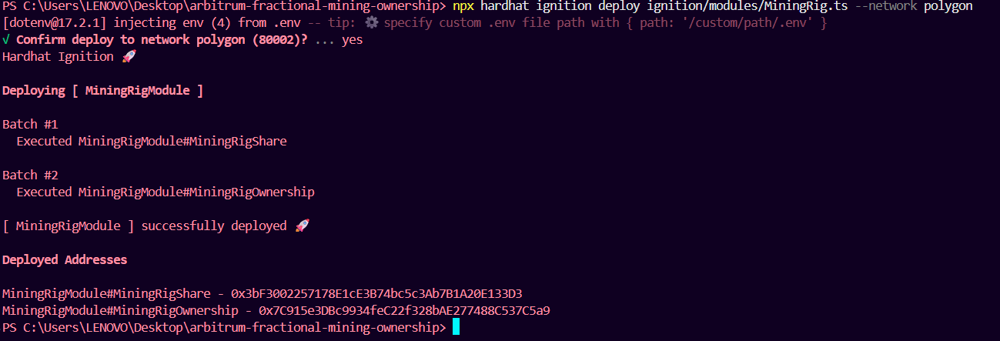
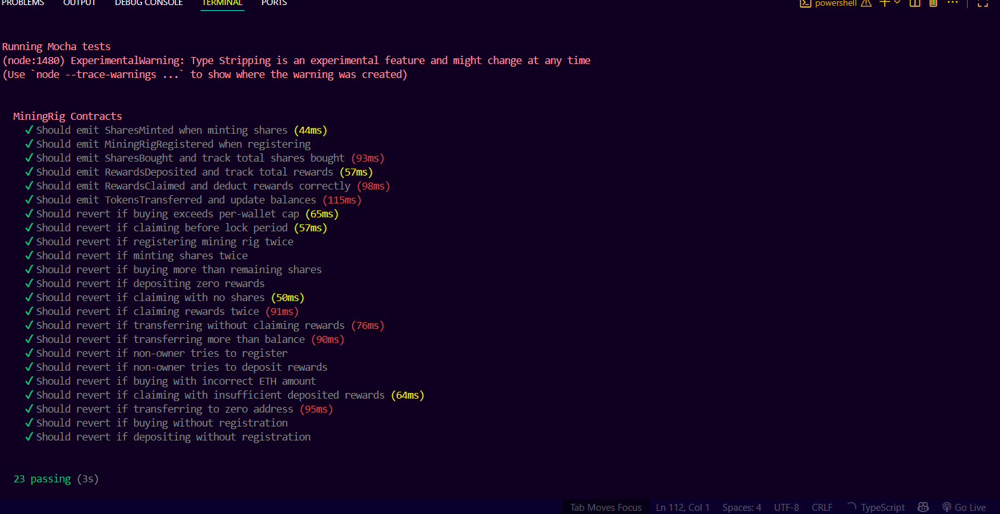

# Polygon Fractional Mining Ownership – Hardhat

This project enables **fractional mining ownership** using Ethereum-compatible smart contracts, deployed on Polygon Amoy, with Hardhat 3, TypeScript, and Solidity. Users can purchase, own, and claim rewards from mining rig shares represented as ERC1155 tokens, and interact through an integrated React+Vite frontend.

## Verified Smart Contracts Links
- [MiningRigShareContract](https://amoy.polygonscan.com/address/0x2dcfC814801364B34fA00894d4832e030585298C#code)
- [MiningRigOwnershipContrat](https://amoy.polygonscan.com/address/0xd4dC87783F0460106eE988f118a3dB824fF160E6#code)

## Table of Contents

- [Overview](#overview)
- [Smart Contracts](#smart-contracts)
- [Architecture](#architecture)
- [Project Structure](#project-structure)
- [Setup](#setup)
- [Hardhat Configuration](#hardhat-configuration)
- [Usage](#usage)
- [Testing](#testing)
- [Frontend](#frontend)
- [Troubleshooting](#troubleshooting)
- [Resources](#resources)
- [License](#license)

## Overview

Fractional Mining is a decentralized system enabling multiple users to collectively own a mining rig by purchasing shares as ERC1155 tokens. Shareholders can **buy shares**, **receive proportional ETH rewards**, and **transfer or claim rewards** through secure, audited smart contracts. Integration is managed by Hardhat (Solidity/TypeScript), with a full-featured Web3 frontend, comprehensive TypeScript test suite, and Ignition modules for simplified deployment.


## Smart Contracts

**contracts/MiningRigShare.sol** 
- ERC1155: One token type for all mining shares, fixed supply (100)
- Mints shares only to the rig's owner (`mint`)
- Restricts owner transfers to approved operators (security)
- Only ownership contract can mint, via explicit address setting

**contracts/MiningRigOwnership.sol**
- Handles: share buying, rig registration, ETH reward deposits, reward claims, transfers
- Owner-only functions for rig setup and reward funding
- Enforces per-wallet share cap, claim cooldown (2min), no reentrancy
- All buy/claim/reward/transfer events emitted for dApp monitoring


**Key Parameters**
- `CAP_PER_WALLET = 10`
- `TOTAL_SHARES = 100`
- `SHARE_ID = 1`
- `CLAIM_LOCK_PERIOD = 2 minutes`

## Hardhat Configuration

- Uses Hardhat 3 Beta with Ethers.js and Mocha for testing.
- Supports multiple networks: Hardhat local, Arbitrum Sepolia, Polygon Amoy, and Sepolia.
- Network configuration is managed via environment variables in `.env` and [hardhat.config.ts](hardhat.config.ts).
- Includes Ignition modules for deployment ([ignition/modules/MiningRig.ts](ignition/modules/MiningRig.ts)).

## Project Structure

```
contracts/                # Solidity smart contracts
test/                     # TypeScript integration tests (Mocha + Ethers)
ignition/modules/         # Ignition deployment modules
artifacts/                # Compiled contract artifacts
arbitrium-fractional-mining-frontend/ # Frontend (Vite + TypeScript)
hardhat.config.ts         # Hardhat configuration
.env                      # Environment variables
```

## Setup

### Requirements

- **Node.js v18+**
- **Hardhat 3 Beta** (`npm i --save-dev hardhat@^3`)
- **OpenZeppelin Contracts**: `npm install @openzeppelin/contracts`
- **TypeScript, ethers.js, dotenv**: installed by default
- **MetaMask**: setup for Polygon Amoy, etc.
- **Test POL**: via [faucet](https://amoy.polygonscan.com/)
## Usage

### Installation
```bash
git clone https://github.com/Ashishk279/Fractional-Mining-Rig-Hardhat.git
cd Fractional-Mining-Rig-Hardhat
npm install

```

### Install Dependencies

```sh
npm install
```
## Hardhat Configuration

- **hardhat.config.ts** 

- **.env:**
Set the following variables in your `.env` file for live deployments:
```bash
 POLYGONSCAN_API_KEY=
 POLYGON_AMOY_RPC_URL=
 POLYGON_AMOY_PRIVATE_KEY=
```
## Usage

### Compile Contracts
```bash
npx hardhat compile

```

### Deploy Contracts (Ignition preferred)

- **Deploy locally**
```bash
npx hardhat ignition deploy ignition/modules/MiningRig.ts --network hardhat

```

- **Deploy to Polygon Amoy**
```bash
npx hardhat ignition deploy --network polygon ignition/modules/MiningRig.ts

```


### Testing

```bash
npx hardhat test
```



## Frontend
- Naviagate to [Github](https://github.com/Ashishk279/Fractional-Mining-Rig-DApp)
- Netlify Link:
  [https://fractional-mining-rig-dapp.netlify.app/](https://fractional-mining-rig-dapp.netlify.app/) 

## Troubleshooting

**Common Issues**

- Contracts not compiling: ensure Solidity version compatibility (`pragma solidity ^0.8.27;`).
- `buyShares` fails: check shareId (should be 1), price math, approvals, and deployment addresses.
- Mint fails: Make sure `setMiningRigOwnershipAddress` is set before mint, and only once.
- Failed deployment: ensure `.env` is correctly set and deployer account has testnet funds.
- Test failures: Check for approvals, registration, upset network config.

**Frontend not updating:**  
Check ABIs and addresses are latest, reload dApp, clear MetaMask cache, and confirm on-chain data matches UI expectations.


## Resources

- [MiningRigShare.sol](contracts/MiningRigShare.sol)
- [MiningRigOwnership.sol](contracts/MiningRigOwnership.sol)
- [test/MiningRig.test.ts](test/MiningRig.test.ts)
- [ignition/modules/MiningRig.ts](ignition/modules/MiningRig.ts)
- [hardhat.config.ts](hardhat.config.ts)
- [Getting Started with Hardhat 3](https://hardhat.org/docs/getting-started#getting-started-with-hardhat-3)
- [Frontend: arbitrium-fractional-mining-frontend/](https://github.com/Ashishk279/Fractional-Mining-Rig-DApp)


## License

MIT License. See LICENSE for details.
